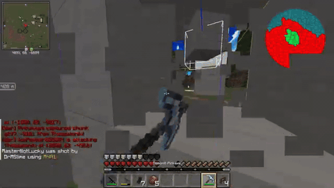

<p align="center">
  <a href="https://aechronis.net">
    <picture>
      
    </picture>
  </a>
</p>

<p align="center">
  <a href="https://discord.gg/aechronis"></a>
  <a href="https://github.com/Aechronis/aechronis/tree/master/.github/workflows"></a>
  
</p>

---

<p align="center">
  <a href="https://youtu.be/bTeR0es2bIE"></a>
</p>

---

### Building

```bash
# run dev environment, automatically reloads when changes are made to modules
./gradlew devRun

# build and run production jars
./gradlew assembleServerDistribution
cd build/distributions/aechronis
java -jar aechronis.jar
```

### Documentation
For more info on the server itself, including specific items, gameplay systems etc. [see our docs](https://aechronis.net). We aim to keep the codebase, for the most part, self-documenting.

### Contributing
If you're interested in contributing to Aechronis, please contact us on [discord](https://discord.gg/aechronis) before submitting a pull request.
